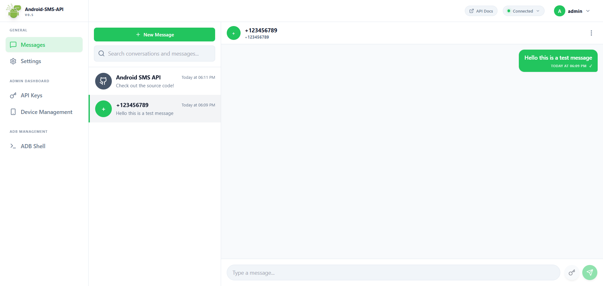
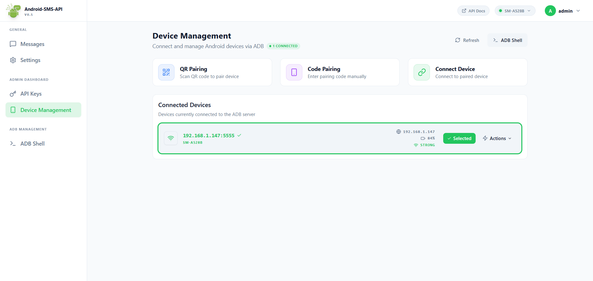
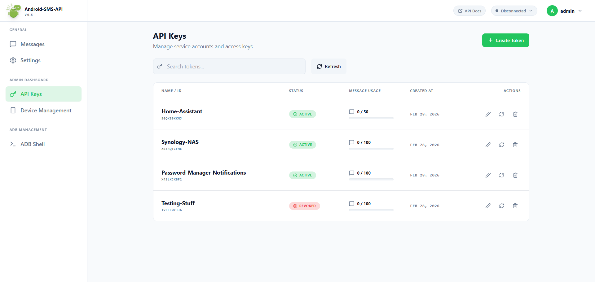
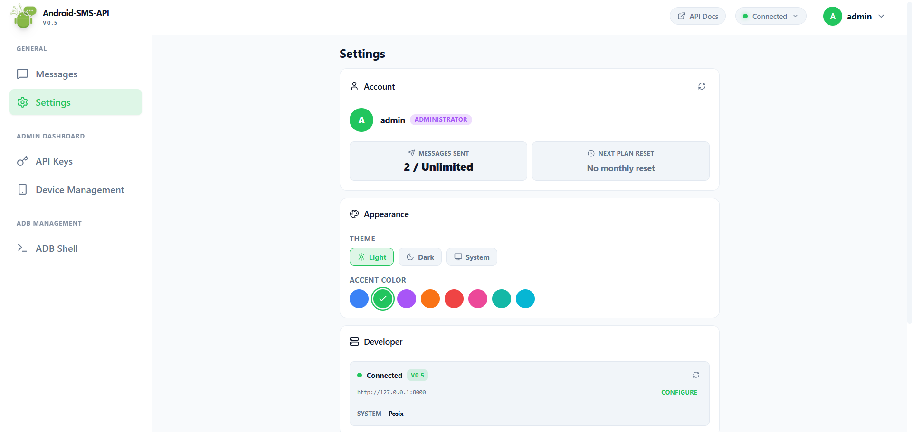

# Android SMS API Gateway 0.5 (Pre-Release)
-orange) 


### Turn your Android device into a professional SMS Server

This application transforms any Android device into a dedicated, self-hosted **SMS Gateway**. It provides a robust **RESTful API** that allows you to programmatically send SMS messages over your cellular network, manage device connections via ADB, enforce secure, role-based access control for multiple users or services, and manage everything through its fully-integrated **UI Dashboard**.

## Table of Contents

- [Features & Capabilities](#features--capabilities)
- [Dashboard](#dashboard)
- [System Architecture](#system-architecture)
  - [Authentication & Security](#authentication--security)
- [Deployment](#deployment)
  - [Docker](#docker)
    - [How to find the specific device path](#how-to-find-the-specific-device-path)
  - [Docker Compose](#docker-compose)
- [Environment Configuration](#environment-configuration)
- [User Management System](#user-management-system)
  - [The Administrator](#the-administrator)
  - [API Tokens (Service Accounts)](#api-tokens-service-accounts)
- [ADB Connection & Hardware Setup](#adb-connection--hardware-setup)
  - [Hardware Recommendations](#hardware-recommendations)
  - [Device Configuration](#device-configuration)
    - [Enabling Developer Options](#enabling-developer-options)
    - [Essential Settings](#essential-settings)
  - [Wireless ADB Pairing (QR-Code)](#wireless-adb-pairing-qr-code)
    - [Trigger the QR Code](#trigger-the-qr-code)
    - [Pairing Instructions](#pairing-instructions)
    - [Verify Connection](#verify-connection)
- [What's New in 0.5](#whats-new-in-05)
- [Version Archive](#version-archive)

---

## Features & Capabilities

* **Turn Key SMS Gateway**: Send SMS messages programmatically via simple HTTP requests.
* **Device Management**: Seamlessly connect and manage Android devices via ADB (Android Debug Bridge) over Wi-Fi or USB.
* **Role-Based Access Control (RBAC)**: Distinct permission levels for Administrators (infrastructure management) and Standard Users (message dispatch).
* **Quota Management**: Automatic tracking of SMS usage per user with monthly resets on a configurable billing day.
* **Remote Shell Execution**: Administrators can execute raw `ADB SHELL` commands directly on the device for advanced debugging or automation.
* **Simple Authentication**: Secure access via JWT-based tokens.

> **Note on Message Content:** Currently, the send-message endpoint supports **ASCII/Plain text only**. Emoji support is in development and is not supported (YET).

---

## Dashboard

The built-in UI Dashboard provides a clean and modern interface for managing your gateway, viewing conversations, monitoring connected devices, and administrating API tokens.
### Main Messages Page


<br>

<details>
<summary><strong>View more screenshots</strong></summary>

<br>

### Devices Management Page


<br>

### API Keys Management Page


<br>

### Settings Page



</details>

---

## System Architecture

### Authentication & Security
The API uses a **Role-Based Access Control (RBAC)** system centered around **API Tokens**.
*   **Administrator**: The single owner of the server. Has full control over the infrastructure, devices, and tokens.
*   **API Tokens**: Secure keys issued by the Administrator. They are used by external applications or scripts to interact with the API (e.g., sending messages). Each token has its own isolate message quota.

---

## Deployment

The application is available as a Docker image. For data persistence (logs and database), you **must** mount the `/data` volume.

> Requirement: To pair a device, you must run this container with Host Networking enabled or map the device via USB Passthrough.

### Docker
Run the container directly using Docker. This method is useful for quick setups, testing, or when you don’t need Docker Compose.

Here is the refined block. I have structured it to clearly separate the "Whole Bus" (recommended) method from the "Specific Device" method, while adding the necessary warning about hot-plugging reliability.

> **Important:**
> * **Persistence:** Execute this command from the directory where you want the `data` folder to be created.
> * **Connectivity:** If you'd like to use the **QR-Pairing** feature replace `-p 8000:8000` with `--net=host` (Flag Working Only On Linux Environments)
> * **Passthrough:**
>
>   **Whole Bus (Recommended):** Use `--device /dev/bus/usb:/dev/bus/usb`. This allows the container to detect the phone even if it is unplugged and replugged.
>
>   **Specific Device:** Use `--device /dev/bus/usb/XXX/YYY` (replace with your specific device path found via `lsusb`).
>   * *Warning: This binds to a specific file descriptor. If the cable is disconnected, the device node ID will change, and the container will lose access until you update the command and restart it.*

### How to find the specific device path

If you choose the specific device method, users will need to know how to find that path. You might want to add this small tip below the block:

```bash
# Run 'lsusb' on the host to find the Bus and Device numbers
# Example Output: Bus 001 Device 004: ID 18d1:4ee7 Google Inc.
# Path: /dev/bus/usb/001/004
```

To start the container, run:

```docker
docker run \
  --restart unless-stopped \
  -p 8000:8000 \
  -v "$(pwd)/data:/app/data" \
  --name android-sms-api \
  agamsol/android-sms-api:latest
```

<details>
<summary><strong>This command will:</strong></summary>

* Pull the image if it’s not already available locally
* Start a single container named <code>android-sms-api</code>
* Expose the API on port <strong>8000</strong> (host) mapped to <strong>8000</strong> (container)
* Persist application data in the local <code>./data</code> directory
* Automatically restart the container unless it is explicitly stopped
</details>

If you need to perform **device QR pairing** or any other interactive setup, run the container in the foreground (as shown above) so you can see the terminal output.

To stop the container:

```bash
docker stop android-sms-api
```

To remove the container:

```bash
docker rm android-sms-api
```

For more information about Docker commands and options, see the official Docker documentation:
[https://docs.docker.com/engine/reference/run/](https://docs.docker.com/engine/reference/run/)


### Docker Compose

For a persistent, server-ready deployment, use the provided [`docker-compose.yml`](docker-compose.yml) file. This setup is recommended for long-running or production-like environments, as it simplifies service management, networking, and restarts.

> **Important:** Make sure you are in the same directory as the `docker-compose.yml` file before running any Docker Compose commands.

#### Starting the service

To start the service in detached (background) mode, run:

```bash
docker compose up -d
```

This will start the container in the background. Use this mode once everything is already configured.

If you need to perform **device QR pairing** or any other interactive setup, start Docker Compose **without** the `-d` flag so you can see the terminal output and interact when needed:

```bash
docker compose up
```

You can stop the service at any time by pressing `Ctrl + C` when running in the foreground.

#### Managing the service

Check the status of the running service:

```bash
docker compose ps
```

View logs for the service (useful for debugging):

```bash
docker compose logs -f
```

Stop the service without removing the container:

```bash
docker compose stop
```

Stop and remove the container, network, and volumes created by Docker Compose:

```bash
docker compose down -v
```

For a full list of available commands, configuration options, and advanced usage, see the official Docker Compose documentation:
[https://docs.docker.com/compose/](https://docs.docker.com/compose/)


---

## Environment Configuration

Create a `.env` file in the root directory using the keys below. You can copy `.env.sample` to get started.

| Key | Description | Default |
| :--- | :--- | :--- |
| `VERSION` | The current version of the application meta info. | `Unknown` |
| `ADMIN_USERNAME` | The username for the immutable hardcoded administrator. | `admin` |
| `ADMIN_PASSWORD` | The password for the hardcoded administrator. **If not specified, a secure random string is automatically generated on startup.** | `<Auto-Generated>` |
| `LOGGER_LEVEL` | Logging verbosity level. | `INFO` |
| `LOGGER_PATH` | Directory path where logs will be stored. | `data/logs` |
| `PLAN_RESET_DAY_OF_MONTH`| The day of the month (1-31) when user message limits are reset. **Set to `0` to disable the monthly reset.** | `23` |
| `DATABASE_PATH` | File path for the SQLite3 database. | `data/Android-SMS-API.db` |
| `ADB_QR_DEVICE_PAIRING` | Set to `True` to enable the QR code pairing endpoint. | `True` |
| `ADB_AUTO_CONNECT` | If `True`, the server attempts to auto-connect to the specific device identifier defined in `ADB_DEFAULT_DEVICE` on startup. | `False` |
| `ADB_DEFAULT_DEVICE` | (Optional) Pre-define a specific device identifier to connect to (Required if Auto-Connect is enabled). | *Empty* |
| `ADB_SHELL_EXECUTION_ROUTE_ENABLED`| Enables the endpoint allowing admins to run raw ADB shell commands. | `True` |
| `MIGRATE_DATABASE` | Set to `True` to enable automatic database schema migrations on startup. Required for upgrading from older versions. | `False` |
| `JWT_ALGORITHM` | Algorithm used for signing JSON Web Tokens. | `HS256` |
| `JWT_ACCESS_TOKEN_EXPIRE_MINUTES`| Token validity duration in minutes. | `60` |
| `JWT_SECRET` | Secret key used to sign the JWT. **If not specified, a secure random string is automatically generated on startup.** | `<Auto-Generated>` |

---

## User Management System

The server manages a tiered user system. Message limits are reset automatically based on the `PLAN_RESET_DAY_OF_MONTH` defined in your environment variables.

### The Administrator
The **Administrator** is the sole privileged user of the system, defined by `ADMIN_USERNAME` and `ADMIN_PASSWORD` in your `.env` file.
*   **Immutability**: This user is hardcoded and cannot be deleted via the API.
*   **Capabilities**:
    *   **Full Access**: Manage devices, tokens, infrastructure, and execute shell commands.
    *   **Unlimited Quota**: The administrator is not subject to message limits.

### API Tokens (Service Accounts)
Instead of creating "User Accounts", the Administrator now issues **API Tokens**. These are ideal for external applications, bots, or services.
*   **Created via**: `POST /auth/tokens/create` (Admin only).
*   **Capabilities**:
    *   **Send SMS**: Access to `POST /adb/send-text-message` (Strictly Text/ASCII).
    *   **List Devices**: Access to `GET /adb/list-devices`.
    *   **Check Status**: Access to `GET /auth/@me` (view own quota).
*   **Quotas**: Each token has a strict monthly message limit. If exceeded, sending messages will return `403 Forbidden`.

---

## ADB Connection & Hardware Setup

Reliability relies on correct hardware setup and persistent ADB connections. The system supports **Standard Connection** (IP/Port or USB) and **Wireless QR-Pairing** (Android 11+).

### Hardware Recommendations

#### Power Source
The Android device must be connected to a power source **24/7** to ensure uninterrupted availability of the SMS gateway.

#### Battery Safety (Critical)
> ⚠️ **Warning:** If possible, remove the physical battery from the device and power it directly via the charging cable. Keeping a battery at 100% charge 24/7 creates a high risk of battery swelling and fire hazards.

### Device Configuration

#### Enabling Developer Options
1.  Navigate to **Settings** > **About Phone**.
2.  Tap **Build Number** 7 times until you see "You are now a developer".

#### Essential Settings
1.  Navigate to **Settings** > **System** > **Developer Options**.
2.  Enable **"Stay Awake"** (Ensures the CPU/Screen does not sleep while charging).
3.  Enable **USB Debugging** (for cable) or **Wireless Debugging** (for Wi-Fi).

### Wireless ADB Pairing (QR-Code)
*Requires Android 11+ and devices on the same Wi-Fi network.*

If `ADB_QR_DEVICE_PAIRING` is set to `True`, the server allows for wireless pairing via QR code. This can be triggered automatically on startup or manually via the API.

#### Trigger the QR Code
You can generate the pairing code in two ways:
* **Automatic Prompt:** On server startup, if `ADB_AUTO_CONNECT` is disabled (or if the auto-connection fails), the server will automatically generate and display a pairing QR code in the terminal.
* **Manual Trigger:** You can generate a new QR code at any time by calling the **GET** `/adb/pair-device` endpoint.

> **Note:** The generated QR code is valid for **5 minutes** before it expires.

#### Pairing Instructions

Once the QR code is displayed:
1.  Navigate to **Settings** > **Developer Options** on your Android device.
2.  Enable **Wireless debugging**.
3.  Tap the **text** "Wireless debugging" (not the toggle) to enter the sub-menu.
4.  Tap **Pair device with QR code**.
5.  Scan the QR code displayed in your terminal or browser

#### Verify Connection
After scanning, the pairing process completes automatically. You can confirm success by:
* Checking the terminal logs for a "Successfully Paired" message.
* Calling the `GET /adb/list-devices` endpoint to verify your device appears with the status `authorized`.

# What's New in 0.5 (Pre-Release)
-orange) 

The main feature of version 0.5 is the new **UI Dashboard**!

#### New Features
*   **UI Dashboard**: Introducing the new UI Dashboard (Still Closed Source) which lives within the same Docker image.
*   **MMS Support**: The routing for `GET /adb/list-messages` now supports MMS Messages.
*   **Update Notifications**: Added a `latest_version` fetch to `/auth/@me` to notify users automatically of updates when available via the Dashboard.
*   **Password Reset**: Added a new password-reset route.

#### Improvements & Fixes
*   **Message Retention**: Core database change in the `messages` table - messages are no longer deleted from the table at the monthly reset date, so they continue to show up in the chat history.
*   **Asynchronous Utils**: `utils/database.py` and `utils/adb.py` now serve their functions as asynchronous.
*   **Code Pairing Fix**: Fixed an issue where code pairing did not connect to the device automatically after the pairing process.
*   **Cleanup**: Partial leftovers cleanup for the deprecated user feature.

# Version Archive

<details>
<summary><strong>What's New in 0.4 (Pre-release)</strong></summary>

-orange) 

#### Token-Based Authentication & System Overhaul
Version 0.4 introduces a major overhaul to the authentication system, replacing traditional user accounts with a more robust **API Token** system.

#### Critical Changes
*   **Database Migration**: You **MUST** set `MIGRATE_DATABASE=True` in your environment variables to upgrade your database schema. The application will not start without this if a migration is pending. (only applies for database created with version 0.3 and lower)
*   **User System**: "Standard Users" have been replaced by **API Tokens**.

#### Features & Improvements
*   **API Tokens**: New endpoints to create, list, manage, and refresh API tokens with specific message limits.
*   **Unified Auth**: Support for both `Authorization: Bearer <TOKEN>` and `X-API-Key: <TOKEN>`.
*   **Token Refresh**: Ability to rotate a token's secret while keeping the same ID and history.
*   **Expanded Access**: API Tokens can now access `/adb/list-devices`.
*   **Status Info**: `GET /auth/@me` now returns detailed quota information.

</details>

<details>
<summary><strong>What's New in 0.3 (Pre-release)</strong></summary>

-orange) 

#### Features & Improvements
*   Added a route to get and list all conversations on the device.
*   Added a route to list all users.
*   `GET /auth/@me` now returns how many messages are left for the current month.

> **_P.S. Parts of this release are preperations for the UI Interface which is coming VERY soon!_**

#### Bug Fixes
*   Timeout handling for ADB `POST /adb/connect-device` - trace back to client.
*   `device_id` was limited to 35 characters (raised to 99) - code pairing devices have longer names than 35 characters.

</details>

<details>
<summary><strong>What's New in 0.2 (Pre-release)</strong></summary>

-orange) 

#### Features & Improvements
*   Added a new API route to support pairing devices via a 6-digit code, offering an alternative to QR code scanning.
*   Replaced the embedded ADB binary with the system-level `android-tools-adb` package. This improves stability and compatibility across different container environments.

#### Bug Fixes
*   Fixed major bugs that made delete-account endpoint not to work.
*   Resolved connectivity issues preventing successful wireless device pairing in Dockerized environments.
*   Fixed an issue where remember_me tokens were not persisting correctly; tokens now utilize a 10-year expiration for long-term sessions.
*   Corrected username validator logic and pattern. Usernames can now be 3–32 characters long, include numbers and hyphens (previously restricted to 10 characters maximum and no numbers were allowed).

</details>

<details>
<summary><strong>What's New in 0.1 (Initial Release)</strong></summary>

 

#### Initial Release
* First release of the Android SMS API Gateway.

</details>
